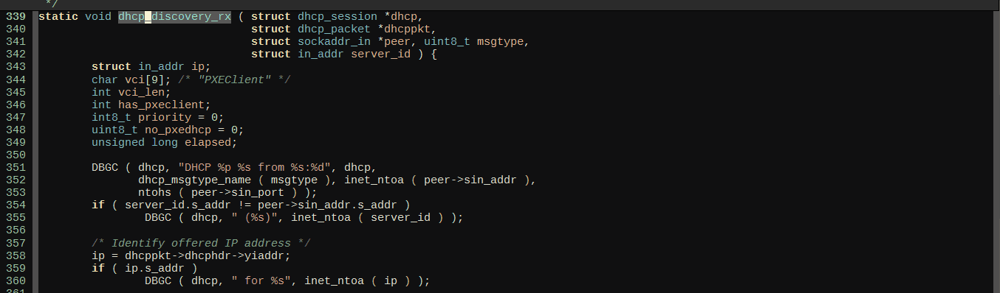
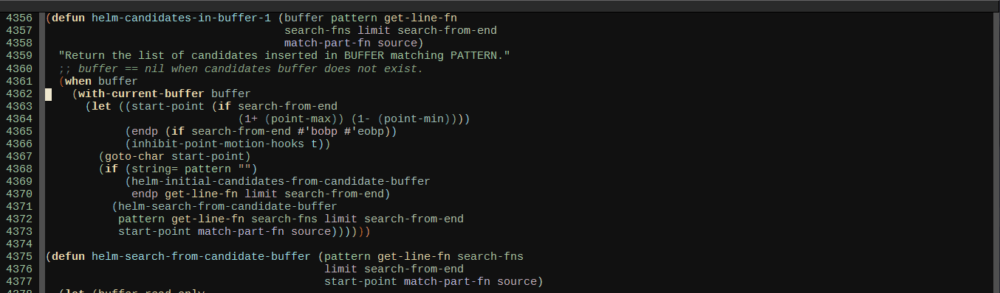
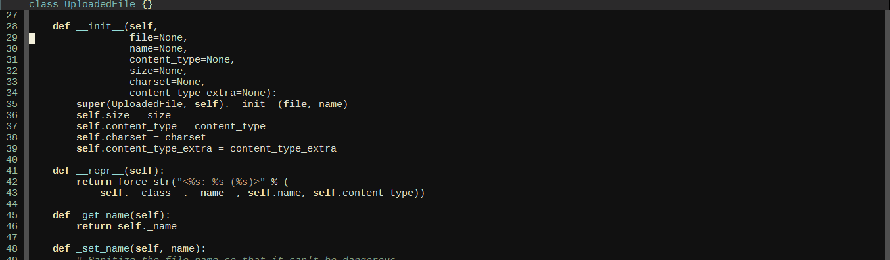

# What is Semantic Stickyfunc Enhance #

This package is an improvement of stock `semantic-stickyfunc-mode` in
[Semantic](https://www.gnu.org/software/emacs/manual/html_node/semantic/index.html#Top),
a parser framework bundled with Emacs. `semantic-stickyfunc-mode`
shows function interface/class/namespace that has part of it at the
top of current visible screen. However, the mode has some limitations
and this package tries to improve it. To visually see the mode in
action, please look at the next section.

# Features #

- Displays parameters scattered on multiple lines. Current
  `semantic-stickyfunc-mode` can only display parameter on the same
  line with the function name.

- Specifically handles Python. Values can be assigned to Python's
  parameters. Current `semantic-stickyfunc-mode` only displays
  parameter names but not its associated values. This package does.

A demo in C:



A demo in Emacs Lisp:



A demo in Python:



# Installation #

You only need to enable `semantic-mode` along with `semantic-stickyfunc-mode`:

```elisp
(add-to-list 'semantic-default-submodes 'global-semantic-stickyfunc-mode)
(semantic-mode 1)
(require 'stickyfunc-enhance)
```
